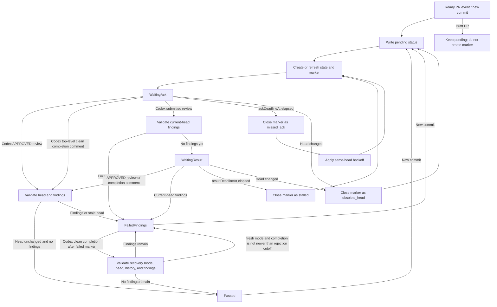

# Codex Review Gate Advanced Design

Languages: [British English (en-GB)](DESIGN.md) | [简体中文 (zh-CN)](DESIGN.zh-CN.md)

## Goal

`codex/review-gate` turns a controlled `@codex review` request into a deterministic commit status that can be required by branch protection. The status should remain `pending` or become `failure` unless the gate can prove that the current PR head has a clean Codex result.

## Generative AI Disclosure

The controlled marker comment intentionally remains a minimal `@codex review` command plus hidden gate metadata so the Codex GitHub integration can parse it reliably. When the workflow posts a controlled marker, it writes the visible disclosure to the GitHub Actions step summary instead: the workflow is requesting a Codex generative AI review, Codex may post AI-generated comments or reviews, and maintainers should verify that output before relying on it for security, correctness, or merge decisions.

The gate is event-driven. Workflow runs create markers, triage Codex signals, resume stored state, or process retry deadlines. They do not need to keep a runner active while Codex reviews the PR.

## Workflow Shape

The recommended workflow listens for:

- `pull_request_target` on `opened`, `reopened`, `ready_for_review`, and `synchronize`
- `issue_comment` on `created`
- `pull_request_review` on `submitted`
- `schedule` for automatic retry scans
- `workflow_dispatch` for manual recovery

`pull_request_review_comment` is optional. It belongs in the `full` event mode for repositories that want the fastest inline-finding triage and accept that a PR with many inline comments may trigger more workflow runs.

The workflow must run trusted default-branch action code. It must not check out or execute PR-supplied code from `pull_request_target` events.

The workflow should use one repository-wide concurrency group with `cancel-in-progress: false`. Scheduled scans can modify any open PR, so they must not run concurrently with PR-specific Codex signal runs.

## Configuration Controls

Repository and organization variables are the preferred control surface for options that should affect workflow routing before a runner starts. Runtime environment variables are accepted as compatibility input once a runner is already running.

### `CODEX_REVIEW_GATE_AUTO_RETRY`

Set this repository or organization variable to `false` to disable scheduled retry work:

```yaml
jobs:
  codex-review-gate:
    if: ${{ github.event_name != 'schedule' || vars.CODEX_REVIEW_GATE_AUTO_RETRY != 'false' }}
```

This must be a `vars` value if the intent is to avoid allocating a runner for scheduled retries. A normal workflow or job `env` value can be read by the action after the job starts, but it cannot prevent the scheduled job from being sent to a runner.

### `CODEX_REVIEW_GATE_EVENT_MODE`

`CODEX_REVIEW_GATE_EVENT_MODE` may be supplied as a repository or organization variable, or as a workflow/job environment variable. If both are supplied, the workflow should pass the most explicit runtime value to the action.

Supported modes:

- `standard`: Default. Handle Codex top-level comments and submitted pull request reviews.
- `comment-only`: Handle only Codex top-level comments as completion signals. Codex findings still block branch protection by leaving the status pending until a scheduled or manual scan evaluates them.
- `full`: Handle Codex top-level comments, submitted pull request reviews, and individual pull request review comments.

These values are exact lower-case strings so workflow-level routing and action runtime validation stay consistent.

### `CODEX_REVIEW_GATE_BOT_LOGINS`

`CODEX_REVIEW_GATE_BOT_LOGINS` may be supplied as a repository or organization variable when the Codex bot identity differs from the defaults. The sample workflow uses this `vars` value in job-level event filters so custom bot comments and reviews can wake the gate before a runner is allocated. The action also accepts the same comma-separated value through the `codex-bot-logins` input at runtime.

### `CODEX_REVIEW_GATE_COMPLETION_SIGNAL_BUFFER_SECONDS`

`CODEX_REVIEW_GATE_COMPLETION_SIGNAL_BUFFER_SECONDS` may be supplied as a repository or organization variable and passed to the action through `completion-signal-buffer-seconds`. The default is `30`. Set it to `0` to disable the extra buffer; completion comments created in the same second as the marker are still rejected because GitHub timestamps are second-resolution.

The buffer applies only to Codex top-level clean completion comments because those comments do not identify the reviewed commit. A completion comment must be created after the active marker and outside the configured buffer window before it can pass the gate. This reduces the chance that a delayed clean completion from an older Codex review is accepted for a newer head. `APPROVED` pull request reviews still use review metadata and do not need this buffer.

`+1` reactions are diagnostic in this design. They are recorded when useful, but they are not the primary pass signal because reactions do not provide a reliable workflow wake event.

`eyes` reactions are liveness signals. The gate checks both PR-body reactions and reactions on the active marker comment. They move `WaitingAck` to `WaitingResult`, but they do not pass the gate.

### `CODEX_REVIEW_GATE_FAILED_FINDINGS_RECOVERY`

`CODEX_REVIEW_GATE_FAILED_FINDINGS_RECOVERY` may be supplied as a repository or organization variable and passed to the action through `failed-findings-recovery`. The runtime `FAILED_FINDINGS_RECOVERY` environment variable is also accepted. If both are present, the action input takes precedence. Empty or unset values default to enabled; set either value to `false` to disable this recovery path.

When enabled, a Codex top-level clean completion comment can recover a same-head `failed_findings` status after maintainers resolve the Codex review threads. The recovery path does not create a marker and does not poll. It reuses the existing `issue_comment` wakeup from the Codex clean completion comment, reloads the PR, verifies that the current head has no unresolved or not-outdated Codex findings, and writes `success`.

### `CODEX_REVIEW_GATE_FAILED_FINDINGS_RECOVERY_MODE`

`CODEX_REVIEW_GATE_FAILED_FINDINGS_RECOVERY_MODE` may be supplied as a repository or organization variable and passed to the action through `failed-findings-recovery-mode`. The runtime `FAILED_FINDINGS_RECOVERY_MODE` environment variable is also accepted. If both are present, the action input takes precedence. Empty or unset values default to `head`.

Supported modes:

- `head`: Default. Treat the latest same-head Codex clean completion comment as reusable head-level evidence. If an earlier recovery run saw unresolved findings, a rerun of that same clean comment event may recover after the findings are resolved.
- `fresh`: Record the time of a recovery attempt that was rejected because current-head findings still existed. Clean completion comments created at or before that rejection time cannot recover later, even if they are different comments. Maintainers must request or wait for a newer Codex clean completion comment after resolving the findings.

## GHA Cost Model

The happy path normally uses two short jobs:

1. A PR event creates or refreshes state, writes `pending`, and posts a controlled `@codex review` marker for the current head.
2. A Codex top-level completion comment or `APPROVED` review wakes triage. The gate reloads the PR, verifies that the head is unchanged, confirms there are no current-head Codex findings, writes `success`, and closes the marker.

Finding paths depend on event mode. In `standard` mode, a Codex submitted review can wake triage and write `failure`. In `comment-only` mode, the status may stay `pending` until a scheduled or manual scan observes the findings.

The resolved-findings recovery path does not add a scheduled job or polling loop. After a `failed_findings` status, maintainers resolve the Codex review threads and a Codex top-level clean completion comment wakes the same `issue_comment` workflow that already handles pass signals. That short job performs one normal snapshot load plus a final validation reload before writing `success`. Compared with manual `workflow_dispatch` recovery, the common clean recovery case avoids one extra manual job.

`failed-findings-recovery-mode=head` keeps the cheapest recovery semantics: if the latest same-head Codex result is clean, resolving the threads can be enough for a rerun of the already-created clean comment event to pass. `failed-findings-recovery-mode=fresh` may require one extra Codex review request after the threads are resolved when an earlier recovery attempt was rejected. Neither mode adds polling or scheduled runner minutes.

The default schedule example is:

```yaml
on:
  schedule:
    - cron: "0 */2 * * *"
```

Each scheduled run scans open PRs in one job. It should skip PRs that are draft, already successful or failed for the current head, missing gate state, or not due for retry. Open PR count affects API calls and wall-clock time, but it should not create one job per PR.

Approximate scheduled runner minutes:

```text
monthly_minutes ~= ceil(avg_schedule_run_seconds / 60) * runs_per_month
runs_per_month ~= 30 * 24 * 60 / cron_interval_minutes
```

For cost-sensitive private repositories, use one or more of:

- a self-hosted runner
- a less frequent schedule
- `CODEX_REVIEW_GATE_AUTO_RETRY=false`
- `CODEX_REVIEW_GATE_EVENT_MODE=comment-only`

## State Model

The gate stores one trusted sticky PR state comment with hidden JSON metadata. The state is the source of truth across event runs, scheduled retries, manual dispatches, and reruns.

The state records:

- current tracked head SHA
- last written status state, head, and run URL
- active marker ID, URL, head SHA, created time, and attempt number
- marker baseline identities for Codex comments, reviews, and diagnostic reactions
- marker deadlines: `ackDeadlineAt`, `resultDeadlineAt`, `nextRetryAt`, `headStartedAt`, and `maxWaitDeadlineAt`
- marker state: `waiting_ack`, `waiting_result`, `passed`, `failed_findings`, `missed_ack`, `stalled`, `timed_out`, `obsolete_head`, or `state_lost`
- bounded marker history for retry backoff and recovery
- in `fresh` failed-findings recovery mode, the latest rejected recovery attempt time plus bounded rejected completion identities on the failed marker history entry

State comments and marker comments are trusted only from configured trusted authors. The default trusted author is `github-actions[bot]`, matching the repository workflow's `GITHUB_TOKEN` path.

## State Machine



```text
NoState / Passed / FailedFindings
  on ready PR event or new commit:
    write pending
    create or refresh sticky state
    close obsolete active marker if present
    create @codex review marker for current head
    do not let existing unresolved findings from an earlier marker block the fresh-head marker
    set ackDeadlineAt, resultDeadlineAt, nextRetryAt, headStartedAt
    -> WaitingAck

WaitingAck
  on Codex APPROVED review after marker for the same head:
    validate current head and current-head findings
    -> Passed or FailedFindings

  on Codex top-level completion comment after marker:
    validate current head and current-head findings
    -> Passed or FailedFindings

  on Codex submitted review after marker for the same head:
    validate current-head findings
    -> FailedFindings if findings exist
    -> WaitingResult otherwise

  on manual, rerun, or schedule when ackDeadlineAt elapsed:
    close active marker as missed_ack
    compute exponential backoff from same-head missed_ack history
    create retry marker when nextRetryAt is due
    -> WaitingAck

WaitingResult
  on Codex APPROVED review or top-level completion comment after marker:
    validate current head and current-head findings
    -> Passed or FailedFindings

  on current-head Codex findings:
    write failure
    close active marker as failed_findings
    -> FailedFindings

  on manual, rerun, or schedule when resultDeadlineAt elapsed:
    close active marker as stalled
    create retry marker
    -> WaitingAck

AnyState
  on draft PR:
    keep or write pending
    do not create a new marker

  on head change:
    close active marker as obsolete_head
    write pending for latest ready head
    create marker for latest ready head
    -> WaitingAck

FailedFindings
  on Codex top-level clean completion comment:
    require failed-findings recovery to be enabled
    require latest same-head marker outcome to be failed_findings
    require completion comment to be newer than failed marker close time
    require the triggering comment to still be visible and still match the Codex clean-completion predicate after final reload
    in head mode, allow the same same-head completion comment to be re-evaluated
    in fresh mode, reject completion comments created at or before the latest rejected recovery attempt
    validate current head and current-head findings
    -> Passed if no findings remain
    -> FailedFindings if findings remain
    in fresh mode, record the rejected completion identity and rejection cutoff when findings remain
```

## Signal Rules

Codex terminal pass signals are:

- a Codex `APPROVED` pull request review submitted strictly after the active marker for the same head
- a Codex top-level clean completion comment created strictly after the active marker plus the configured completion signal buffer, currently identified by the `Codex Review:` prefix

Before writing `success`, the gate must reload the PR and verify:

- the current PR head still matches the active marker head
- there are no current-head Codex findings
- the terminal signal is newer than the active marker and, for top-level completion comments, outside the configured buffer window

Codex findings are current-head findings when they are attached to the current head through pull request review metadata, inline review comments, or review-body links. Inline findings should use GraphQL review-thread state where available so resolved or outdated threads are not treated as active findings.

If PR-open automatic Codex review is still enabled, its output is not trusted as a pass by itself. Only terminal signals after the active controlled marker can pass the gate, and the final current-head finding check still applies.

There is one recovery exception for `failed_findings`: if `failed-findings-recovery` is enabled, the latest same-head marker outcome is `failed_findings`, and the triggering issue comment is a Codex top-level clean completion comment created after that marker was closed, the gate may write `success` without an active marker after the final current-head finding check passes. The final reload must still contain that triggering comment, and the current comment body and author must still match the Codex clean-completion predicate. Human `@codex review` comments, deleted or edited-away clean comments, and clean comments created before or at the failed marker close time cannot recover the gate.

`failed-findings-recovery-mode` controls how same-head clean completions behave after a blocked recovery attempt. In `head` mode, the same completion comment remains valid evidence for the latest head and may pass after maintainers resolve the findings. In `fresh` mode, a rejected recovery attempt records a cutoff time on the failed marker history entry; any clean completion comment created at or before that cutoff is ignored, and only a later clean completion comment can recover.

## Fork and Dependabot PRs

GitHub documents that [PR review events other than `pull_request_target` can receive a read-only `GITHUB_TOKEN`](https://docs.github.com/en/actions/reference/workflows-and-actions/events-that-trigger-workflows#workflows-in-forked-repositories) for fork and Dependabot PRs, and Dependabot-triggered `pull_request_target`, review, and comment events can also run with a read-only token. The sample workflow therefore filters Dependabot event wakeups before runner allocation, and the action skips the same write path defensively if a user workflow omits that filter.

Fork PR review events are opportunistic: if the current PR head is from a fork, the action skips `pull_request_review` and `pull_request_review_comment` writes and relies on top-level `issue_comment`, schedule, or manual recovery. Dependabot PRs rely on schedule or manual recovery for all write-capable progress. Scheduled scans may initialise a Dependabot PR with no prior gate state because the per-event wakeups are intentionally ignored.

## Retry and Recovery

`workflow_dispatch` may target one PR or scan open PRs. A rerun should behave like a resume operation: reload the current PR state from GitHub, ignore stale event head assumptions, and advance the state machine only from current evidence.

If the sticky state comment is missing but a trusted marker comment exists, the gate must recover safely:

1. Record the recovered marker as `state_lost`.
2. Baseline currently visible Codex signals.
3. Do not pass from the recovered marker.
4. Create a fresh marker or fail from current-head findings.

If the sticky state comment exists but marker creation failed before a marker comment was persisted, scheduled recovery treats the current-head pending state as needing a fresh marker. The same retry rule applies after a marker is closed as `missed_ack` or `stalled` but posting the replacement marker fails.

Scheduled runs process retry deadlines. They should scan open PRs, load state only for candidate PRs, and advance markers whose `nextRetryAt`, `ackDeadlineAt`, or `resultDeadlineAt` has elapsed.

If a scheduled or manual scan fails while processing a specific PR, the gate writes an `error` status to that PR head before reporting the aggregate scan failure. This keeps a previous `success` status from surviving an inconclusive recovery run.

Consecutive `missed_ack` outcomes on the same head use exponential backoff. A head change or any non-`missed_ack` outcome resets that ack backoff history for the new marker.

After `failed_findings`, maintainers can resolve the Codex review threads and request or wait for a same-head Codex clean result. The Codex clean completion comment triggers `issue_comment` and can recover the status when `failed-findings-recovery` is enabled. In `head` mode, a same-head clean completion comment can be re-evaluated after the threads are resolved. In `fresh` mode, if a recovery run was rejected while findings remained, maintainers need a clean completion comment created after that rejected attempt. If this event-driven recovery is disabled or inconclusive, `workflow_dispatch` remains the manual recovery path.

## Branch Protection

Repository rulesets should require:

- the `codex/review-gate` status check
- GitHub's native conversation-resolution protection, when the repository wants unresolved inline conversations to block merges

The status check decides whether the current head has a clean Codex review signal. Conversation resolution remains a separate branch-protection concern.
