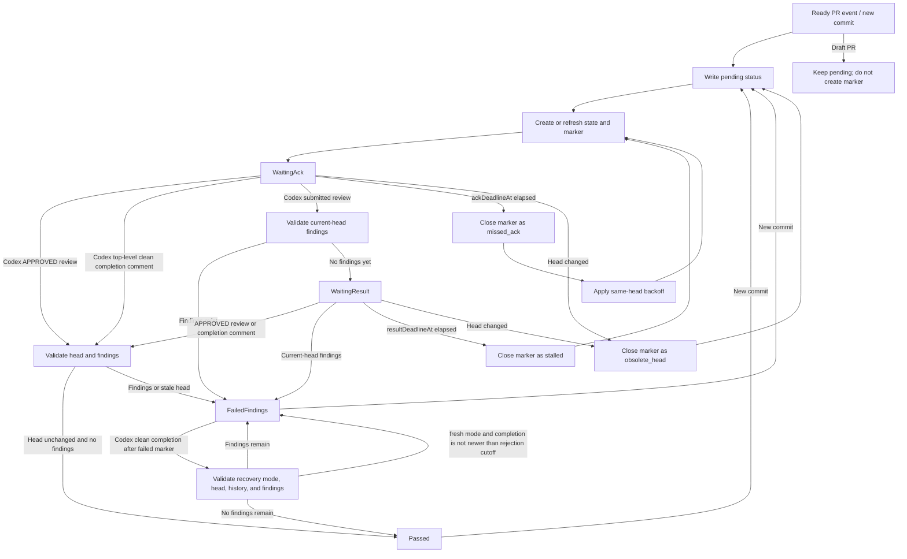

# Codex Review Gate 高级设计

语言：[British English (en-GB)](DESIGN.md) | [简体中文 (zh-CN)](DESIGN.zh-CN.md)

## 目标

`codex/review-gate` 把受控 `@codex review` 请求转换成 deterministic commit status，并可被 branch protection 要求。除非 gate 能证明当前 PR head 有干净的 Codex 结果，否则这个 status 应保持 `pending` 或变成 `failure`。

## 生成式 AI 提示

受控 marker comment 会刻意保持为最小的 `@codex review` command 加 hidden gate metadata，以便 Codex GitHub integration 可靠解析。Workflow 发布受控 marker 时，会改在 GitHub Actions step summary 中写出可见提示：workflow 正在请求 Codex 生成式 AI review，Codex 可能在 PR 中发布 AI 生成的 comments 或 reviews，维护者在把这些输出用于安全性、正确性或 merge 决策前，应先进行人工核验。

Gate 是 event-driven 的。Workflow runs 会创建 markers、triage Codex signals、恢复已存储状态，或处理 retry deadlines。它们不需要在 Codex review PR 时一直占用 runner。

## Workflow 形状

推荐 workflow 监听：

- `pull_request_target` 的 `opened`、`reopened`、`ready_for_review` 和 `synchronize`
- `issue_comment` 的 `created`
- `pull_request_review` 的 `submitted`
- `schedule` 用于自动 retry scans
- `workflow_dispatch` 用于手动恢复

`pull_request_review_comment` 是可选项。它属于 `full` event mode，适合希望最快 triage inline findings，并接受一个有大量 inline comments 的 PR 可能触发更多 workflow runs 的仓库。

Workflow 必须运行可信 default branch 上的 action code。它不能在 `pull_request_target` events 中 checkout 或执行 PR 提供的代码。

Workflow 应使用一个 repository-wide concurrency group，并设置 `cancel-in-progress: false`。Scheduled scans 可以修改任何 open PR，所以它们不能和 PR-specific Codex signal runs 并发运行。

## 配置控制项

Repository 和 organization variables 是需要在 runner 启动前影响 workflow routing 的选项的首选控制面。Runtime environment variables 仍作为兼容输入接受，但只能在 runner 已经启动后生效。

### `CODEX_REVIEW_GATE_AUTO_RETRY`

把这个 repository 或 organization variable 设为 `false`，即可禁用 scheduled retry work：

```yaml
jobs:
  codex-review-gate:
    if: ${{ github.event_name != 'schedule' || vars.CODEX_REVIEW_GATE_AUTO_RETRY != 'false' }}
```

如果目标是避免为 scheduled retries 分配 runner，这必须是 `vars` 值。普通 workflow 或 job `env` 可以被 action 在 job 启动后读取，但不能阻止 scheduled job 被发送到 runner。

### `CODEX_REVIEW_GATE_EVENT_MODE`

`CODEX_REVIEW_GATE_EVENT_MODE` 可以作为 repository variable、organization variable 或 workflow/job environment variable 提供。如果两者都提供，workflow 应把最明确的 runtime value 传给 action。

支持的模式：

- `standard`: 默认值。处理 Codex top-level comments 和 submitted pull request reviews。
- `comment-only`: 只把 Codex top-level comments 当作 completion signals。Codex findings 仍会通过让 status 保持 pending 来阻塞 branch protection，直到 scheduled 或 manual scan 评估它们。
- `full`: 处理 Codex top-level comments、submitted pull request reviews 和 individual pull request review comments。

这些值是精确的小写字符串，这样 workflow-level routing 和 action runtime validation 能保持一致。

### `CODEX_REVIEW_GATE_BOT_LOGINS`

当 Codex bot identity 和默认值不同时，可以提供 `CODEX_REVIEW_GATE_BOT_LOGINS` repository 或 organization variable。示例 workflow 在 job-level event filters 中使用这个 `vars` 值，让自定义 bot comments 和 reviews 可以在 runner 分配前唤醒 gate。Action 也通过 `codex-bot-logins` input 接受同一个 comma-separated value。

### `CODEX_REVIEW_GATE_COMPLETION_SIGNAL_BUFFER_SECONDS`

`CODEX_REVIEW_GATE_COMPLETION_SIGNAL_BUFFER_SECONDS` 可以作为 repository 或 organization variable 提供，并通过 `completion-signal-buffer-seconds` 传给 action。默认值是 `30`。设为 `0` 可以关闭额外 buffer；与 marker 同一秒创建的 completion comments 仍会被拒绝，因为 GitHub timestamps 是秒级精度。

Buffer 只适用于 Codex top-level clean completion comments，因为这些 comments 不标识被 review 的 commit。Completion comment 必须在 active marker 之后创建，并且位于配置的 buffer window 之外，才能让 gate 通过。这降低了旧 Codex review 的延迟 clean completion 被错误接受到新 head 的风险。`APPROVED` pull request reviews 仍使用 review metadata，不需要这个 buffer。

`+1` reactions 在这个设计中是 diagnostic signals。它们在有用时会被记录，但不是主要 pass signal，因为 reactions 没有可靠的 workflow wake event。

`eyes` reactions 是 liveness signals。Gate 会检查 PR-body reactions 和 active marker comment 上的 reactions。它们会把 `WaitingAck` 推进到 `WaitingResult`，但不会让 gate 通过。

### `CODEX_REVIEW_GATE_FAILED_FINDINGS_RECOVERY`

`CODEX_REVIEW_GATE_FAILED_FINDINGS_RECOVERY` 可以作为 repository 或 organization variable 提供，并通过 `failed-findings-recovery` 传给 action。Runtime `FAILED_FINDINGS_RECOVERY` environment variable 也被支持。如果两者都存在，action input 优先生效。留空或未设置时默认启用；把任一值设为 `false` 可关闭该恢复路径。

启用后，在维护者 resolve Codex review threads 之后，一个 Codex top-level clean completion comment 可以恢复同一个 head 上的 `failed_findings` status。这个恢复路径不创建 marker，也不轮询。它复用 Codex clean completion comment 已经触发的 `issue_comment` wakeup，重新加载 PR，确认当前 head 没有 unresolved 或 not-outdated Codex findings，然后写入 `success`。

### `CODEX_REVIEW_GATE_FAILED_FINDINGS_RECOVERY_MODE`

`CODEX_REVIEW_GATE_FAILED_FINDINGS_RECOVERY_MODE` 可以作为 repository 或 organization variable 提供，并通过 `failed-findings-recovery-mode` 传给 action。Runtime `FAILED_FINDINGS_RECOVERY_MODE` environment variable 也被支持。如果两者都存在，action input 优先生效。留空或未设置时默认 `head`。

支持的模式：

- `head`：默认值。把 latest same-head Codex clean completion comment 视为可复用的 head-level evidence。如果较早的 recovery run 看到 unresolved findings，那么在 findings resolved 后，rerun 同一个 clean comment event 也可以恢复。
- `fresh`：记录因 current-head findings 仍存在而被拒绝的 recovery attempt 时间。早于或等于该 rejected attempt 的 clean completion comments 之后都不能恢复，即使它们是不同 comments。维护者必须在 resolve findings 之后请求或等待更新的 Codex clean completion comment。

## GHA 成本模型 (cost model)

Happy path 通常使用两个短 job：

1. 一个 PR event 创建或刷新 state，写入 `pending`，并为当前 head 发布受控 `@codex review` marker。
2. 一个 Codex top-level completion comment 或 `APPROVED` review 唤醒 triage。Gate 重新加载 PR，确认 head 未变化，确认没有 current-head Codex findings，写入 `success`，并关闭 marker。

Finding paths 取决于 event mode。在 `standard` mode 中，Codex submitted review 可以唤醒 triage 并写入 `failure`。在 `comment-only` mode 中，status 可能保持 `pending`，直到 scheduled 或 manual scan 观察到 findings。

Resolved-findings recovery path 不新增 scheduled job，也不引入 polling loop。`failed_findings` 之后，维护者 resolve Codex review threads，Codex top-level clean completion comment 会唤醒本来就处理 pass signals 的同一个 `issue_comment` workflow。这个短 job 会做一次常规 snapshot load，并在写入 `success` 前做一次 final validation reload。相比 manual `workflow_dispatch` recovery，常见 clean recovery 场景通常少一次额外手动 job。

`failed-findings-recovery-mode=head` 是成本最低的恢复语义：如果 latest same-head Codex result 是 clean，那么 resolve threads 后，rerun 已经创建的 clean comment event 就可能 pass。`failed-findings-recovery-mode=fresh` 在较早 recovery attempt 被拒绝时，可能需要 resolve threads 后再触发一次额外 Codex review。两种模式都不新增 polling 或 scheduled runner minutes。

默认 schedule 示例：

```yaml
on:
  schedule:
    - cron: "0 */2 * * *"
```

每个 scheduled run 在一个 job 中扫描 open PRs。它应跳过 draft、当前 head 已经 success 或 failed、缺少 gate state，或 retry 尚未到期的 PR。Open PR 数量会影响 API calls 和 wall-clock time，但不应为每个 PR 创建一个 job。

近似 scheduled runner minutes：

```text
monthly_minutes ~= ceil(avg_schedule_run_seconds / 60) * runs_per_month
runs_per_month ~= 30 * 24 * 60 / cron_interval_minutes
```

对 cost-sensitive private repositories，可以使用以下一个或多个选项：

- self-hosted runner
- 降低 schedule 频率
- `CODEX_REVIEW_GATE_AUTO_RETRY=false`
- `CODEX_REVIEW_GATE_EVENT_MODE=comment-only`

## 状态模型

Gate 用一个可信 sticky PR state comment 存储 hidden JSON metadata。这个 state 是 event runs、scheduled retries、manual dispatches 和 reruns 之间的 source of truth。

State 记录：

- 当前 tracked head SHA
- 最近写入的 status state、head 和 run URL
- active marker ID、URL、head SHA、创建时间和 attempt number
- Codex comments、reviews 和 diagnostic reactions 的 marker baseline identities
- marker deadlines: `ackDeadlineAt`、`resultDeadlineAt`、`nextRetryAt`、`headStartedAt` 和 `maxWaitDeadlineAt`
- marker state: `waiting_ack`、`waiting_result`、`passed`、`failed_findings`、`missed_ack`、`stalled`、`timed_out`、`obsolete_head` 或 `state_lost`
- 用于 retry backoff 和 recovery 的 bounded marker history
- 在 `fresh` failed-findings recovery mode 中，failed marker history entry 会记录 latest rejected recovery attempt time 和 bounded rejected completion identities

State comments 和 marker comments 只信任配置的 trusted authors。默认 trusted author 是 `github-actions[bot]`，匹配 repository workflow 的 `GITHUB_TOKEN` 路径。

## 状态机



```text
NoState / Passed / FailedFindings
  on ready PR event or new commit:
    write pending
    create or refresh sticky state
    close obsolete active marker if present
    create @codex review marker for current head
    do not let existing unresolved findings from an earlier marker block the fresh-head marker
    set ackDeadlineAt, resultDeadlineAt, nextRetryAt, headStartedAt
    -> WaitingAck

WaitingAck
  on Codex APPROVED review after marker for the same head:
    validate current head and current-head findings
    -> Passed or FailedFindings

  on Codex top-level completion comment after marker:
    validate current head and current-head findings
    -> Passed or FailedFindings

  on Codex submitted review after marker for the same head:
    validate current-head findings
    -> FailedFindings if findings exist
    -> WaitingResult otherwise

  on manual, rerun, or schedule when ackDeadlineAt elapsed:
    close active marker as missed_ack
    compute exponential backoff from same-head missed_ack history
    create retry marker when nextRetryAt is due
    -> WaitingAck

WaitingResult
  on Codex APPROVED review or top-level completion comment after marker:
    validate current head and current-head findings
    -> Passed or FailedFindings

  on current-head Codex findings:
    write failure
    close active marker as failed_findings
    -> FailedFindings

  on manual, rerun, or schedule when resultDeadlineAt elapsed:
    close active marker as stalled
    create retry marker
    -> WaitingAck

AnyState
  on draft PR:
    keep or write pending
    do not create a new marker

  on head change:
    close active marker as obsolete_head
    write pending for latest ready head
    create marker for latest ready head
    -> WaitingAck

FailedFindings
  on Codex top-level clean completion comment:
    require failed-findings recovery to be enabled
    require latest same-head marker outcome to be failed_findings
    require completion comment to be newer than failed marker close time
    require the triggering comment to still be visible and still match the Codex clean-completion predicate after final reload
    in head mode, allow the same same-head completion comment to be re-evaluated
    in fresh mode, reject completion comments created at or before the latest rejected recovery attempt
    validate current head and current-head findings
    -> Passed if no findings remain
    -> FailedFindings if findings remain
    in fresh mode, record the rejected completion identity and rejection cutoff when findings remain
```

## Signal Rules

Codex terminal pass signals 是：

- Codex `APPROVED` pull request review，必须在 active marker 之后提交，并且对应同一个 head
- Codex top-level clean completion comment，必须在 active marker 加上配置的 completion signal buffer 之后创建；当前通过 `Codex Review:` prefix 识别

写入 `success` 前，gate 必须重新加载 PR 并确认：

- 当前 PR head 仍匹配 active marker head
- 没有 current-head Codex findings
- terminal signal 比 active marker 更新；对于 top-level completion comments，还必须位于配置的 buffer window 之外

当 findings 通过 pull request review metadata、inline review comments 或 review-body links 关联到当前 head 时，它们是 current-head findings。Inline findings 应尽可能使用 GraphQL review-thread state，避免把已 resolved 或 outdated threads 当成 active findings。

如果仍启用了 PR-open automatic Codex review，其输出本身不被信任为 pass。只有 active controlled marker 之后的 terminal signals 才能通过 gate，并且仍必须经过最终 current-head finding check。

`failed_findings` 有一个 recovery exception：如果 `failed-findings-recovery` 已启用、latest same-head marker outcome 是 `failed_findings`，并且触发 workflow 的 issue comment 是在该 marker 关闭之后创建的 Codex top-level clean completion comment，那么 gate 可以在 final current-head finding check 通过后，在没有 active marker 的情况下写入 `success`。Final reload 必须仍能看到该 triggering comment，并且当前 comment body 和 author 仍要匹配 Codex clean-completion predicate。人类 `@codex review` comments、已删除或被编辑成非 clean 的 comments，以及早于或等于 failed marker close time 创建的 clean comments，不能恢复 gate。

`failed-findings-recovery-mode` 控制 same-head clean completions 在 blocked recovery attempt 之后如何处理。在 `head` 模式中，同一个 completion comment 仍然是 latest head 的有效 evidence，维护者 resolve findings 后可以通过。在 `fresh` 模式中，被拒绝的 recovery attempt 会在 failed marker history entry 上记录 cutoff time；早于或等于该 cutoff 的 clean completion comments 都会被忽略，只有之后新的 clean completion comment 可以恢复。

## Fork 和 Dependabot PRs

GitHub 文档说明，fork 和 Dependabot PRs 的非 `pull_request_target` PR review events 可能收到 read-only `GITHUB_TOKEN`；Dependabot 触发的 `pull_request_target`、review 和 comment events 也可能以 read-only token 运行。示例 workflow 因此会在 runner 分配前过滤 Dependabot event wakeups；如果用户 workflow 省略该 filter，action 也会 defensively 跳过同一路径。

Fork PR review events 是 opportunistic 的：如果当前 PR head 来自 fork，action 会跳过 `pull_request_review` 和 `pull_request_review_comment` writes，并依赖 top-level `issue_comment`、schedule 或 manual recovery。Dependabot PRs 依赖 schedule 或 manual recovery 来取得所有 write-capable progress。Scheduled scans 可以初始化没有 prior gate state 的 Dependabot PR，因为 per-event wakeups 被有意忽略。

## Retry 和 Recovery

`workflow_dispatch` 可以 target 一个 PR，也可以 scan open PRs。Rerun 应像 resume operation 一样工作：从 GitHub 重新加载当前 PR state，忽略 stale event head assumptions，并只根据当前 evidence 推进 state machine。

如果 sticky state comment 丢失但存在 trusted marker comment，gate 必须安全恢复：

1. 把 recovered marker 记录为 `state_lost`。
2. Baseline 当前可见的 Codex signals。
3. 不从 recovered marker 通过。
4. 创建 fresh marker，或因 current-head findings 失败。

如果 sticky state comment 存在，但 marker creation 在 marker comment 被持久化前失败，scheduled recovery 会把 current-head pending state 视为需要 fresh marker。Marker 被关闭为 `missed_ack` 或 `stalled` 后，如果 replacement marker 发布失败，也使用同样的 retry rule。

Scheduled runs 处理 retry deadlines。它们应扫描 open PRs，只为 candidate PRs 加载 state，并推进 `nextRetryAt`、`ackDeadlineAt` 或 `resultDeadlineAt` 已经过期的 markers。

如果 scheduled 或 manual scan 在处理某个具体 PR 时失败，gate 会先向该 PR head 写入 `error` status，再报告 aggregate scan failure。这避免上一次 `success` status 在 inconclusive recovery run 后继续存活。

同一个 head 上连续的 `missed_ack` outcomes 使用 exponential backoff。Head change 或任何非 `missed_ack` outcome 都会为新 marker 重置 ack backoff history。

`failed_findings` 之后，维护者可以 resolve Codex review threads，再请求或等待同一 head 的 Codex clean result。Codex clean completion comment 会触发 `issue_comment`，并可在 `failed-findings-recovery` 启用时恢复 status。在 `head` 模式中，same-head clean completion comment 可以在 threads resolved 后被重新评估。在 `fresh` 模式中，如果某次 recovery run 在 findings 仍存在时被拒绝，维护者需要一个创建时间晚于该 rejected attempt 的 clean completion comment。如果这个 event-driven recovery 被关闭或无法得出结论，`workflow_dispatch` 仍是手动恢复路径。

## Branch Protection

Repository rulesets 应要求：

- `codex/review-gate` status check
- GitHub 原生 conversation-resolution protection，如果仓库希望 unresolved inline conversations 阻塞 merge

Status check 判断当前 head 是否有干净的 Codex review signal。Conversation resolution 仍是独立的 branch-protection concern。
